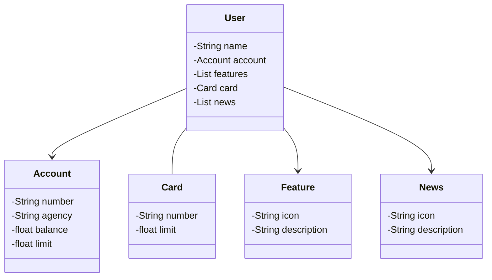

# Projeto Spring Web API - Bootcamp SANTANDER - DIO

## Diagrama de Classes

```mermaid
classDiagram
    class User {
        -String name
        -Account account
        -List<Feature> features
        -Card card
        -List<News> news
    }
    
    class Account {
        -String number
        -String agency
        -float balance
        -float limit
    }
    
    class Card {
        -String number
        -float limit
    }
    
    class Feature {
        -String icon
        -String description
    }
    
    class News {
        -String icon
        -String description
    }

    User --> Account
    User -- Card
    User --> Feature
    User --> News

```
